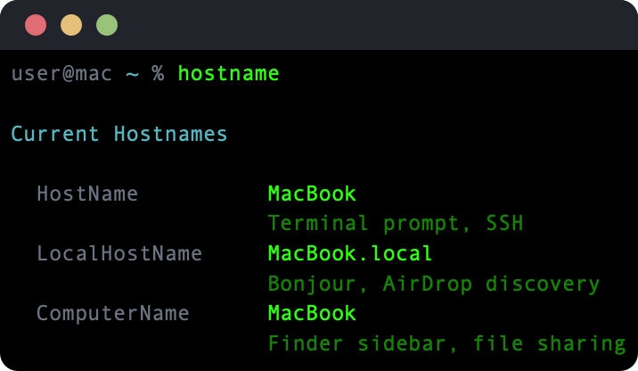

# hostname


View and manage all three macOS hostname types — HostName, LocalHostName, and ComputerName.



## What it does

macOS maintains three separate hostname values, each used in different contexts:

| Type | Used by |
|------|---------|
| **HostName** | Terminal prompt, SSH |
| **LocalHostName** | Bonjour, AirDrop discovery |
| **ComputerName** | Finder sidebar, file sharing |

Running `hostname` without arguments shows all three. Passing a new name sets all three at once via `scutil` and flushes the DNS cache.

## Install

Requires Swift 6.0+ and macOS 14+. Depends on [swift-cli-core](https://github.com/ansilithic/swift-cli-core) and [swift-argument-parser](https://github.com/apple/swift-argument-parser).

```sh
git clone https://github.com/ansilithic/hostname.git
cd hostname
make build && make install
```

The binary installs to `/usr/local/bin/hostname`.

## Usage

```
USAGE: hostname [<new-hostname>]

ARGUMENTS:
  <new-hostname>          New hostname to set (omit to show current)

OPTIONS:
  --version               Show the version.
  -h, --help              Show help information.
```

### Examples

```sh
# Show current hostnames
hostname

# Set all three hostnames at once (requires sudo)
hostname MacBook
```

## License

MIT
